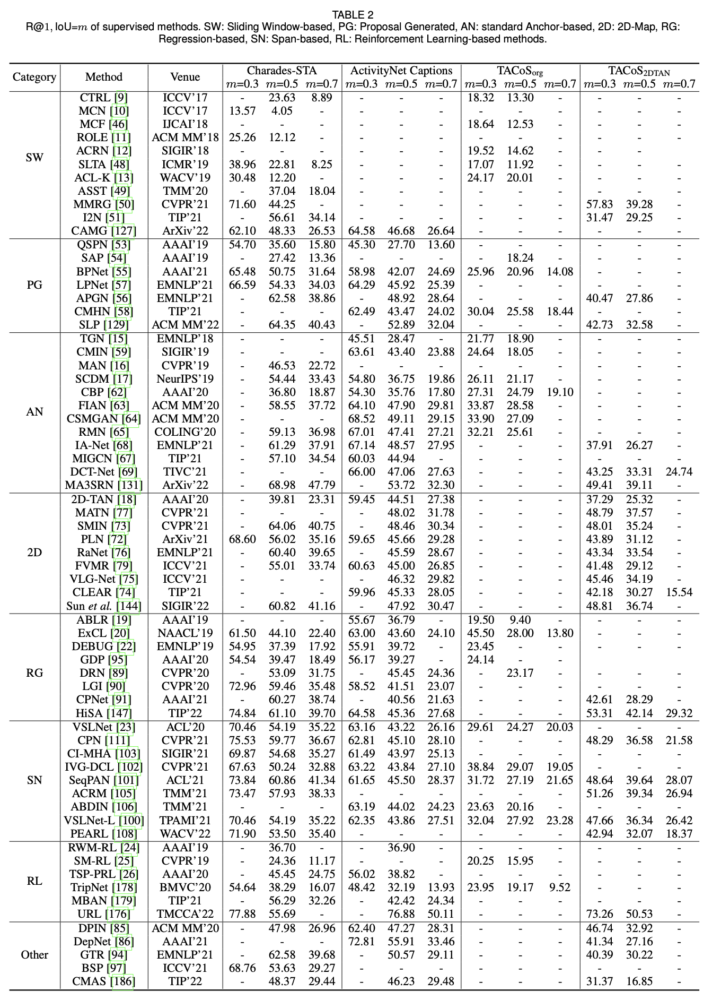

# Awesome-video-moment-retrieval

A personal paper list on Video Moment Retrieval (VMR), or Natural Language Video Localization (NLVL), or Temporal Sentence Grounding in Videos (TSGV)), Natural Language Query (NLQ).

- Keywords: moment retrieval, temporal grounding, video/language/moment grounding/localization, sentence grounding, etc.

## 1 Papers List

Summarized by,

- :star:  ​[VMR papers by methods](./plist-by-methods.md)
- [VMR papers by scholars](./plist-by-people.md)
- [VMR papers by year](./plist-by-year.md)

## 2 Quick references

### **Survey**

- [视频片段检索研究综述, 软件学报，2020](http://www.jos.org.cn/jos/article/abstract/6707)
- [A survey on temporal sentence grounding in videos](https://arxiv.org/abs/2109.08039). *in ArXiv 2021*
- [The Elements of Temporal Sentence Grounding in Videos: A Survey and Future Directions](https://arxiv.org/abs/2201.08071). *in ArXiv 2022*

### Datasets

|                         **Dataset**                          | **Video Source** |   **Domain**    |
| :----------------------------------------------------------: | :--------------: | :-------------: |
| [**TACoS**](https://www.mpi-inf.mpg.de/departments/computer-vision-and-machine-learning/research/vision-and-language/tacos-multi-level-corpus) |     Kitchen      |     Cooking     |
| [**Charades-STA**](https://prior.allenai.org/projects/charades) |      Homes       | Indoor Activity |
| [**ActivityNet Captions**](http://activity-net.org/download.html) |     Youtube      |      Open       |
| [**DiDeMo**](<https://github.com/LisaAnne/LocalizingMoments>) |      Flickr      |      Open       |
|     [**MAD**](https://github.com/Soldelli/MAD)， CVPR22      |      Movie       |      Open       |

Referring to [this paper](https://openaccess.thecvf.com/content/ICCV2021W/CVEU/papers/Soldan_VLG-Net_Video-Language_Graph_Matching_Network_for_Video_Grounding_ICCVW_2021_paper.pdf), more info,

| Dataset              | Video # | VL-pair# --> train | val   | Test  | Vocab Size |
| -------------------- | ------- | ------------------ | ----- | ----- | ---------- |
| ActivityNet Captions | 14926   | 37421              | 17505 | 17031 | 15406      |
| TACoS                | 127     | 10146              | 4589  | 4083  | 2255       |
| DiDeMo               | 10642   | 33005              | 4180  | 4021  | 7523       |
| Charades-STA         | 6670    | 12404              | -     | 3720  | 1289       |

Normally, top three is widely used. Then processed feature,

> Visual: 1) by 3D ConvNet, e.g. C3D, I3D 2) by 2D ConvNet, e.g. vgg
>
> Text: 1) pretained word embeddings, e.g. GloVe 2) pre-trained language models, e.g. BERT
>
> NEW MAD: both by CLIP.

extracted features can be downloaded from

- https://github.com/microsoft/VideoX/tree/master/MS-2D-TAN

### Process

### Performance Comparisons

## 3 Resources

- [yawenzeng-paperlist](https://github.com/yawenzeng/Awesome-Cross-Modal-Video-Moment-Retrieval)
- [Soldelli-paperlist](https://github.com/Soldelli/Awesome-Temporal-Language-Grounding-in-Videos)
- [NeverMoreLCH-Video-grounding](https://github.com/NeverMoreLCH/Awesome-Video-Grounding)
- [Alvin-Zeng-Temporal-Action-Localization](https://github.com/Alvin-Zeng/Awesome-Temporal-Action-Localization)

