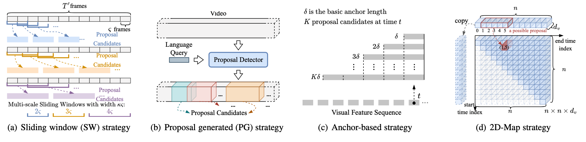
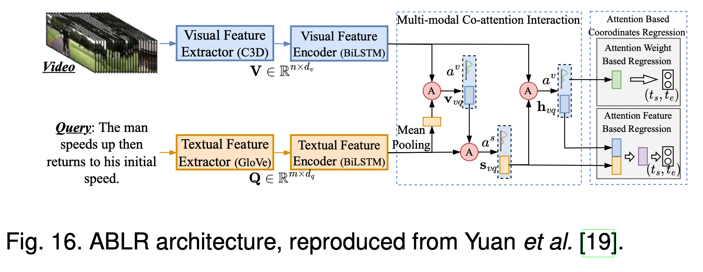
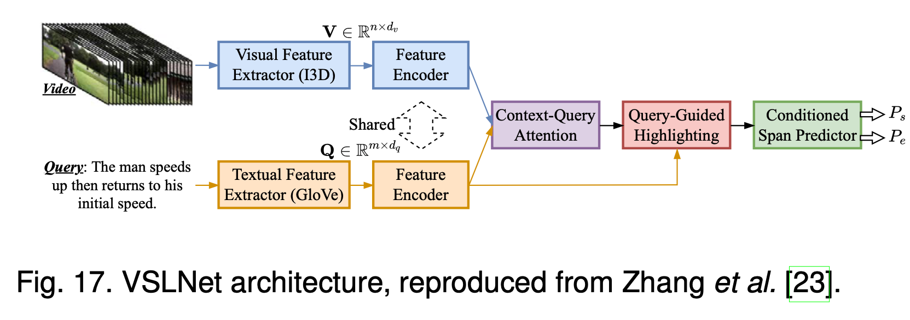

## VMR - papers - by - Methods

> Rely heavilly on the survey, "Temporal Sentence Grounding in Videos: A Survey and Future Directions", 2022

### Datasets

| **Dataset** | **Video Source** | **Domain** |
|:-----------:|:----------------:|:----------:|
| [**TACoS**](https://www.mpi-inf.mpg.de/departments/computer-vision-and-machine-learning/research/vision-and-language/tacos-multi-level-corpus)            |       Kitchen        |   Cooking    |
| [**Charades-STA**](https://prior.allenai.org/projects/charades)            |         Homes         |      Indoor Activity      |
| [**ActivityNet Captions**](http://activity-net.org/download.html)            |      Youtube            |     Open       |
| [**DiDeMo**](<https://github.com/LisaAnne/LocalizingMoments>)            |          Flickr        |     Open       |
|  [**MAD**](https://github.com/Soldelli/MAD)， CVPR22   |      Movie            |    Open        |

```latex
@inproceedings{activitynet17,
  title={Dense-captioning events in videos},
  author={Krishna, Ranjay and Hata, Kenji and Ren, Frederic and Fei-Fei, Li and Carlos Niebles, Juan},
  booktitle={Proceedings of the IEEE international conference on computer vision},
  pages={706--715},
  year={2017}
}

@article{tacos2013,
  title={Grounding action descriptions in videos},
  author={Regneri, Michaela and Rohrbach, Marcus and Wetzel, Dominikus and Thater, Stefan and Schiele, Bernt and Pinkal, Manfred},
  journal={Transactions of the Association for Computational Linguistics},
  volume={1},
  pages={25--36},
  year={2013},
  publisher={MIT Press}
}

@inproceedings{DedemoMCN17,
  title={Localizing moments in video with natural language},
  author={Anne Hendricks, Lisa and Wang, Oliver and Shechtman, Eli and Sivic, Josef and Darrell, Trevor and Russell, Bryan},
  booktitle={Proceedings of the IEEE international conference on computer vision},
  pages={5803--5812},
  year={2017}
}

@inproceedings{Charades17tall,
  title={Tall: Temporal activity localization via language query},
  author={Gao, Jiyang and Sun, Chen and Yang, Zhenheng and Nevatia, Ram},
  booktitle={Proceedings of the IEEE international conference on computer vision},
  pages={5267--5275},
  year={2017}
}
```


## 1 Proposal-based Methods



### 1) Sliding Window-based

> - CTRL ---> MAC 
> - MCN ---> MLLC
> - (Interactions/fusions) ROLE, ACRN, MCF, TCMN, ~~ASST~~
> - SLTA, MMRG (integrate more info)
> - I2N (propose insides)

*Sliding window-based method adopts a multi-scale sliding windows (SW) to generate proposal candidates.*

- :star: **CTRL:** [Tall: Temporal activity localization via language query](https://arxiv.org/abs/1705.02101). *in ICCV 2017*. 
  - https://github.com/jiyanggao/TALL
- **MAC:** [Mac: Mining activity concepts for language-based temporal localization](https://arxiv.org/abs/1811.08925). *in WACV 2019*. 
  - https://github.com/runzhouge/MAC, w/ jiyanggao
  - another implement, https://github.com/WuJie1010/Temporally-language-grounding
  - using activity as a prior,
- :star:**MCN:** [Localizing moments in video with natural language](https://arxiv.org/abs/1708.01641). *in ICCV 2017*
  - https://github.com/LisaAnne/LocalizingMoments
- **MLLC:** [Localizing moments in video with temporal language](https://aclanthology.org/D18-1168.pdf). *in EMNLP 2018*
  - https://github.com/LisaAnne/TemporalLanguageRelease
  - same auther of MCN
  - UNIFY CTRL and MCN
- **ROLE:** [Cross-modal moment localization in videos](https://dl.acm.org/doi/10.1145/3240508.3240549). *in ACM MM 2018*
- **ACRN:** [Attentive moment retrieval in videos](https://dl.acm.org/doi/10.1145/3209978.3210003). *in SIGIR 2018*
  - Both from: https://mengliu1991.github.io/
  - code is missing
  - Also from the Prof. liqiang Nie‘s group
  - check https://liqiangnie.github.io/Links.html
- **MCF:** [Multi-modal circulant fusion for video-to-language and backward](https://www.ijcai.org/proceedings/2018/0143.pdf). *in IJCAI 2018*
  - https://github.com/AmingWu/Multi-modal-Circulant-Fusion
  - http://cic.tju.edu.cn/faculty/hanyahong/Publications.html
- **TCMN:** [Exploiting temporal relationships in video moment localization with natural language](https://arxiv.org/abs/1908.03846). *in ACM MM 2019*.
  - https://github.com/Sy-Zhang/TCMN-Release
- **SLTA:** [Cross-modal video moment etrieval with spatial and language-temporal attention](https://dl.acm.org/doi/10.1145/3323873.3325019). *in ICMR 2019*.
  - https://github.com/BonnieHuangxin/SLTA

---

- **MMRG:** [Multi-modal relational graph for cross-modal video moment retrieval](https://openaccess.thecvf.com/content/CVPR2021/papers/Zeng_Multi-Modal_Relational_Graph_for_Cross-Modal_Video_Moment_Retrieval_CVPR_2021_paper.pdf). *in CVPR 2021*
  - Many papers on VMR from the first author, but also many of them is not open
- **I2N:** [Interaction-integrated network for natural language moment localization](https://ieeexplore.ieee.org/document/9334438). *in TIP 2021*
  - cannot found, tbd.
- **ASST:** [An attentive sequence to sequence translator for localizing video clips by natural language](https://ieeexplore.ieee.org/stamp/stamp.jsp?tp=&arnumber=8931634). *in TMM 2020*
  - https://github.com/NeonKrypton/ASST, not open sofar


### 2) Proposal Generated Method

*Proposal generated (PG) method alleviates the computation burden of SW-based methods and generates proposals conditioned on the query.*

> - :thumbsup: Text-to-Clip (<----R-C3D), Mutilevel(AAAI version) === still two-stage
>   - with a query re-generation loss 
> - BPNet, LP-Net, APGN, SLP, === one-stage
> - WWRC

- **Text-to-Clip:** [Text-toclip video retrieval with early fusion and re-captioning](https://arxiv.org/abs/1804.05113v1). *in ArXiv 2018*
  - Later: renamed: [Multilevel Language and Vision Integration for Text-to-Clip Retrieval ](https://arxiv.org/abs/1804.05113v3)， AAAI 2019
  - https://github.com/VisionLearningGroup/Text-to-Clip_Retrieval, Pycaffe
- **R-C3D**: [R-C3D: Region Convolutional 3D Network for Temporal Activity Detection](https://openaccess.thecvf.com/content_ICCV_2017/papers/Xu_R-C3D_Region_Convolutional_ICCV_2017_paper.pdf), ICCV 2017
  - same author to text-to-clip
  - see the citation... way more papers on activity localization 
  - https://github.com/VisionLearningGroup/R-C3D
- **BPNet:** [Boundary proposal network for two-stage natural language video localization](https://arxiv.org/abs/2103.08109). *in AAAI 2021*
- **LP-Net:** [Natural language video localization with learnable moment proposals](https://aclanthology.org/2021.emnlp-main.327.pdf). *in EMNLP 2021*
  - Two papers from the same author
  - https://github.com/xiaoneil/LPNet,,, under updating
- **CMHN:** [Video moment localization via deep cross-modal hashing](https://ieeexplore.ieee.org/document/9416231) *in TIP 2021*.
  - [Paper-link](https://liqiangnie.github.io/paper/CMHN_Video%20Moment%20Localization%20via%20Deep%20Cross-modal%20Hashing.pdf)
  - https://github.com/Huyp777/CMHN
  - Two more from the author
    - https://github.com/Huyp777/CSUN
    - https://github.com/Huyp777/SEEN

----

- **APGN:** [Adaptive proposal generation network for temporal sentence localization in videos](https://aclanthology.org/2021.emnlp-main.732.pdf). *in EMNLP 2021*
- **SLP:** [Skimming, Locating, then Perusing: A Human-Like Framework for Natural Language Video Localization](https://arxiv.org/abs/2207.13450), ACM MM 2022
  - many many VL papers from the first author, "Daizong Liu"
  - but, cannot find the source code..
  - check https://github.com/liudaizong
- **SAP:** [Semantic proposal for activity localization in videos via sentence query](https://ojs.aaai.org/index.php/AAAI/article/view/4830/4703). *in AAAI 2019*

- **WWRC:** [Efficient Video Grounding With Which-Where Reading Comprehension](https://repository.kaust.edu.sa/bitstream/handle/10754/676735/Efficient_Video_Grounding_with_Which-Where_Reading_Comprehension.pdf?sequence=1), TCSVT, 2022

  - https://huntersxsx.github.io/

  

### 3) Anchor-based Method
*Anchor-based methods incorporates proposal generation into answer prediction and maintains the proposals with various learning modules.*

> - :thumbsup: TGN
>   - :thumbsup:CMIN, 
> - CBP, HDDR, MIGCN, ~~FIAN~~
> - :thumbsup:SCDM, 
>   - ~~MAN~~
>   - CSMGAN, RMN, IA-NET, (where is the code??)
> - ECCL, MA3SRN

- **TGN:** [Temporally grounding natural sentence in video](https://aclanthology.org/D18-1015.pdf). *in EMNLP 2018*.
  - https://github.com/JaywongWang/TGN
- **SCDM:** [Semantic conditioned dynamic modulation for temporal sentence grounding in videos](https://proceedings.neurips.cc/paper/2019/file/6883966fd8f918a4aa29be29d2c386fb-Paper.pdf). *in NeurIPS 2019*. 
  - https://github.com/yytzsy/SCDM
  - also a [PAMI version]([Semantic conditioned dynamic modulation for temporal sentence grounding in videos](https://ieeexplore.ieee.org/document/9263333)).
    - https://github.com/yytzsy/SCDM-TPAMI
- **CMIN:** [Cross-modal interaction networks for query-based moment retrieval in videos](https://arxiv.org/abs/1906.02497). *in SIGIR 2019*.
  - https://github.com/ikuinen/CMIN_moment_retrieval
  - Also a [TIP version](https://ieeexplore.ieee.org/document/8962274), https://ieeexplore.ieee.org/document/8962274
    - Moment Retrieval via Cross-Modal Interaction Networks With Query Reconstruction
- **CBP:** [Temporally grounding language queries in videos by contextual boundary-aware prediction](https://arxiv.org/abs/1909.05010). *in AAAI 2020*.
  - https://github.com/JaywongWang/CBP
- **HDRR:** [Hierarchical deep residual reasoning for temporal moment localization](https://arxiv.org/abs/2111.00417). *ACM MM Asia 2021*
  - https://github.com/ddlBoJack/HDRR
- **MIGCN:** [Multi-modal interaction graph convolutional network for temporal language localization in videos](https://arxiv.org/abs/2110.06058). *in TIP 2021*
  - https://github.com/zmzhang2000/MIGCN/
  - from the same group as HDRR
  - check https://liqiangnie.github.io/index.html on multi-modal tasks

---

- **CSMGAN:** [Jointly cross- and self-modal graph attention network for query-based moment localization](https://arxiv.org/abs/2008.01403). *in ACM MM 2020*
- **RMN:** [Reasoning step-by-step: Temporal sentence localization in videos via deep rectification-modulation network](https://aclanthology.org/2020.coling-main.167.pdf). *in COLING 2020*
- **IA-Net:** [Progressively guide to attend: An iterative alignment framework for temporal sentence grounding](https://aclanthology.org/2021.emnlp-main.733.pdf). *in EMNLP 2021*
  - all these paper from Daizong Liu (a lot more!!)
  - https://github.com/liudaizong/IA-Net --> no code here
  - Many paper on this field. almost never release source code
- **FIAN:** [Finegrained iterative attention network for temporal language localization in videos](https://arxiv.org/abs/2008.02448). *in ACM MM 2020*
  - no code so far
- **MAN:** [Man: Moment alignment network for natural language moment retrieval via iterative graph adjustmen](https://openaccess.thecvf.com/content_CVPR_2019/papers/Zhang_MAN_Moment_Alignment_Network_for_Natural_Language_Moment_Retrieval_via_CVPR_2019_paper.pdf). *in CVPR 2019*
  - https://github.com/dazhang-cv/MAN,, no code here.
  - many papers on moment or acitivity localization.
  - Why create a repo if you never tend to release your code? weird.
- **DCT-Net:** [Dct-net: A deep co-interactive transformer network for video temporal grounding](https://www.sciencedirect.com/science/article/abs/pii/S0262885621000883). *in Image and Vision Computing 2021*

---

- **ECCL:** [ECCL: Explicit Correlation-Based Convolution Boundary Locator for Moment Localization](https://ieeexplore.ieee.org/abstract/document/9414047), ICASSP, 21
- **MA3SRN**: [Exploring Optical-Flow-Guided Motion and Detection-Based Appearance for Temporal Sentence Grounding](https://arxiv.org/pdf/2203.02966.pdf)
  - From Daizong Liu, no code sofar


### 4) 2D-Map Anchor-based Method

> - :thumbsup: 2D-TAN, MS-2d-TAN
>   - PLN, STCM-Net, Differente temporal granularities
>   - :thumbsup:SMIN, CLEAR, semnatic contents
> - VLG-Net, RaNet, using GCN
> - MMN， metric learning
> - FVMR, CCA
> - SV-VMR, MATN
> - +++ recent many papers

- **2D-TAN:** [Learning 2d temporal adjacent networks formoment localization with natural language](https://arxiv.org/abs/1912.03590). *in AAAI 2020*.
  - https://github.com/microsoft/VideoX/tree/master/2D-TAN
  - https://github.com/ChenJoya/2dtan  (improved verions)
- **MS 2DTAN:** [Multi-scale 2d temporal adjacency networks for moment localization with natural language](https://arxiv.org/abs/2012.02646). *in TPAMI 2021*. 
  - PAMI verison of 2d-TAN, with multi-scale
  - https://github.com/microsoft/2D-TAN/tree/ms-2d-tan
- **G-TAD**: G-TAD: Sub-Graph Localization for Temporal Action Detection， CVPR 2020
  - https://github.com/frostinassiky/gtad
  - https://www.deepgcns.org/app/g-tad
- **MMN:** [Negative sample matters: A renaissance of metric learning for temporal grounding](https://arxiv.org/abs/2109.04872). *in AAAI 2022*. 
  - https://github.com/MCG-NJU/MMN
  - metric alignment instead of fusion
- **RaNet:** [Relation-aware video reading comprehension for temporal language grounding](https://aclanthology.org/2021.emnlp-main.324.pdf). *in EMNLP 2021*.
  - https://github.com/Huntersxsx/RaNet
- **CLEAR:** [Coarseto-fine semantic alignment for cross-modal moment localization](https://liqiangnie.github.io/paper/Coarse-to-Fine%20Semantic%20Alignment%20for%20Cross-Modal%20Moment%20Localization.pdf). *in TIP 2021*
  - https://github.com/Huyp777/CSUN
- **MATN:** [Multi-stage aggregated transformer network for temporal language localization in videos](https://openaccess.thecvf.com/content/CVPR2021/papers/Zhang_Multi-Stage_Aggregated_Transformer_Network_for_Temporal_Language_Localization_in_Videos_CVPR_2021_paper.pdf). *in CVPR 2021*
  - from wellknow, Heng Tao Shen....
  - No code so far
- **SMIN:** [Structured multi-level interaction network for video moment localization via language query](https://openaccess.thecvf.com/content/CVPR2021/papers/Wang_Structured_Multi-Level_Interaction_Network_for_Video_Moment_Localization_via_Language_CVPR_2021_paper.pdf). *in CVPR 2021*
- **FVMR:** [Fast video moment retrieval](https://openaccess.thecvf.com/content/ICCV2021/papers/Gao_Fast_Video_Moment_Retrieval_ICCV_2021_paper.pdf). *in ICCV 2021*
- **CCA**: [Learning Commonsense-aware Moment-Text Alignment for Fast Video Temporal Grounding](https://arxiv.org/pdf/2204.01450.pdf)
  - https://github.com/ZiyueWu59/CCA
- **PLN:** [Progressive localization networks for language-based moment localization](https://arxiv.org/abs/2102.01282). *in ArXiv 2021*
- **STCM-Net:** [Stcm-net: A symmetrical one-stage network for temporal language localization in videos](https://www.sciencedirect.com/science/article/abs/pii/S0925231221016945). *in Neurocomputing 2022*
- **VLG-Net:** [Vlg-net: Videolanguage graph matching network for video grounding](https://openaccess.thecvf.com/content/ICCV2021W/CVEU/papers/Soldan_VLG-Net_Video-Language_Graph_Matching_Network_for_Video_Grounding_ICCVW_2021_paper.pdf). *in ICCV Workshop 2021*
- **SV-VMR:** [Diving into the relations: Leveraging semantic and visual structures for video moment retrieval](https://ieeexplore.ieee.org/document/9428369). *in ICME 2021*

----

- [A Hybird Alignment Loss for Temporal Moment Localization with Natural Language](https://ieeexplore.ieee.org/abstract/document/9859675), ICME, 2022
- **DCLN**: [Dual-Channel Localization Networks for Moment Retrieval with Natural Language](https://dl.acm.org/doi/pdf/10.1145/3512527.3531394), ICMR, 2022
- **TACI**: [Learning to combine the modalities of language and video for temporal moment localization](https://www.sciencedirect.com/science/article/pii/S1077314222000145)
- **CLAP:** [Contrastive language-action pre-training for temporal localization](https://arxiv.org/pdf/2204.12293.pdf)
  - Mengmeng xu, the author of g-tad, 
  - https://github.com/facebookresearch/vq2d_cvpr
  - a masked contrastive learning loss to capture visio-linguistic relations between activities, background video clips and language in the form of captions.

- **Debias-TLL**： [Learning Sample Importance for Cross-Scenario Video Temporal Grounding](https://arxiv.org/abs/2201.02848)
- Exploring language hierarchy for video grounding, TIP 22
- Cross-modal dynamic networks for video moment retrieval with text query, TMM 22
- Language-enhanced object rea- soning networks for video moment retrieval with text query, *Computers and Electrical Engineering*
- **MGPN:** [You need to read again: Multi-granularity perception network for moment retrieval in videos](https://arxiv.org/pdf/2205.12886.pdf), SIGIR 2022
  - https://github.com/Huntersxsx/MGPN


## 2 Proposal-free Methods

### **1) Regression-based Method**



*Regression-based method computes a time pair ($t_s$, $t_e$) and compares the computed pair with ground-truth ($τ_s$, $τ_e$) for model optimization.*

> :thumbsup: ABLR
>
> DEBUG, GDP, DRN -- imbalance issues
>
> CMA, DeNet--> bias issue
>
> :thumbsup: LGI,

- **ABLR:** [To find where you talk: Temporal sentence localization in video with attention based location regression](https://arxiv.org/abs/1804.07014). *in AAAI 2019*. 
  - https://github.com/yytzsy/ABLR_code
- **ExCL:** [ExCL: Extractive Clip Localization Using Natural Language Descriptions](https://aclanthology.org/N19-1198.pdf). *in NAACL 2019*
- **DEBUG:** [DEBUG: A dense bottomup grounding approach for natural language video localization](https://aclanthology.org/D19-1518.pdf). *in EMNLP 2019*
- **GDP:** [Rethinking the bottom-up framework for query-based video localization](https://ojs.aaai.org/index.php/AAAI/article/view/6627). *in AAAI 2020*
  - Debug, gpd, from Jun xiao's group
  - https://scholar.google.com/citations?user=fqOwFhQAAAAJ&hl
- **DRN:** [Dense regression network for video grounding](https://arxiv.org/abs/2004.03545). *in CVPR 2020*. 
  - https://github.com/Alvin-Zeng/DRN
- **CMA::** [A simple yet effective method for video temporal grounding with cross-modality attention](https://arxiv.org/abs/2009.11232). *in ArXiv 2020
- **DeNet:** [Embracing uncertainty: Decoupling and de-bias for robust temporal grounding](https://arxiv.org/abs/2103.16848). *in CVPR 2021*
- 
- **LGI:** [Local-global video-text interactions for temporal grounding](https://openaccess.thecvf.com/content_CVPR_2020/papers/Mun_Local-Global_Video-Text_Interactions_for_Temporal_Grounding_CVPR_2020_paper.pdf). *in CVPR 2020*. 
  - https://github.com/JonghwanMun/LGI4temporalgrounding
- **CPNet:** [Proposal-free video grounding with contextual pyramid network](https://ojs.aaai.org/index.php/AAAI/article/view/16285). *in AAAI 2021*
- 
- **SSMN:** [Single-shot semantic matching network for moment localization in videos](https://dl.acm.org/doi/10.1145/3441577?sid=SCITRUS). *in ACM TOMCCAP 2021*
- **HVTG:** [Hierarchical visual-textual graph for temporal activity localization via language](https://www.ecva.net/papers/eccv_2020/papers_ECCV/papers/123650596.pdf). *in ECCV 2020*. 
  - https://github.com/forwchen/HVTG
- **MARN:** [Weakly-supervised multilevel attentional reconstruction network for grounding textual queries in videos](https://arxiv.org/abs/2003.07048). *in ArXiv 2020*
- **PMI:** [Learning modality interaction for temporal sentence localization and event captioning in videos](https://www.ecva.net/papers/eccv_2020/papers_ECCV/papers/123490324.pdf). *in ECCV 2020*
- **DRFT:** [End-to-end multi-modal video temporal grounding](https://arxiv.org/abs/2107.05624). *in NeurIPS 2021*
  - https://github.com/wenz116/DRFT
  - only intro， w/o code

- **VISA**: [Compositional temporal grounding with structured variational cross-graph correspondence learning](https://openaccess.thecvf.com/content/CVPR2022/papers/Li_Compositional_Temporal_Grounding_With_Structured_Variational_Cross-Graph_Correspondence_Learning_CVPR_2022_paper.pdf), CVPR 22
  - https://github.com/YYJMJC/Compositional-Temporal-Grounding
  - only intro， w/o code
  - publish ECCV, CVPR, NIPS in 2022, to check more (no code is kinda borring, not much convincing)

- **HLGT:** [Hierarchical local- global transformer for temporal sentence grounding](https://arxiv.org/pdf/2208.14882.pdf)
  - Daizong Liu, code ...
- [Memory-guided semantic learning network for temporal sentence grounding](https://www.aaai.org/AAAI22Papers/AAAI-111.LiuD.pdf)
  - daizong liu, code ...
- [exploring motion and appearance information for temporal sentence grounding](https://www.aaai.org/AAAI22Papers/AAAI-112.LiuD.pdf), AAAI 2022
  - daizong liu, code ...
- **Hisa：** [Hisa: Hierarchically semantic associating for video temporal grounding](https://ieeexplore.ieee.org/document/9846867/authors#authors), TIP 22
- **PLPNet:** [Phrase-level Prediction for Video Temporal Localization](https://dl.acm.org/doi/abs/10.1145/3512527.3531382), MM 22
  - https://github.com/sizhelee/PLPNet


### **2) Span-based Method**



*Span-based methods aim to predict the probability of each video snippet/frame being the start and end positions of target moment.*

> - insipred by reading comprehension task in NLP
>
>   - Bidirectional attention flow for machine comprehension, ICLR 2017
>
>   - Fast and accurate reading comprehension by combining self-attention and
>
>     convolution, ICLR 2018
>
>   - Fusionnet: Fusing via fully-aware attention with application to machine comprehension, ICLR 2018
>
> - ExCL, L-Net
>
> - :thumbsup: VSLNET, 2 papers
>
> - :thumbsup: SeqPAN, 
>
>   - Introduce concept of NER in NLP
>
> - TMLGA, IVG
>

- **ExCL:** [ExCL: Extractive Clip Localization Using Natural Language Descriptions](https://aclanthology.org/N19-1198.pdf). *in NAACL 2019*
- **L-Net:** [Localizing natural language in videos](https://ojs.aaai.org/index.php/AAAI/article/view/4827). *in AAAI 2019*
- **VSLNet:** [Span-based localizing network for natural language video localization](https://aclanthology.org/2020.acl-main.585.pdf). *in ACL 2020*. 
  - https://github.com/IsaacChanghau/VSLNet
  - **PAMI version** [Natural language video localization: A revisit in span-based question answering framework](https://arxiv.org/abs/2102.13558).
- **TMLGA:** [Proposal-free temporal moment localization of a natural-language query in video using guided attention](https://arxiv.org/abs/1908.07236). *in WACV 2020*. 
  - https://github.com/crodriguezo/TMLGA
- = **SeqPAN:** [Parallel attention network with sequence matching for video grounding](https://arxiv.org/abs/2105.08481). *in Findings of ACL 2021*.
  - https://github.com/IsaacChanghau/SeqPAN
- **IVG:** [Interventional video grounding with dual contrastive learning](https://arxiv.org/abs/2106.11013). *in CVPR 2021*. 
  - https://github.com/nanguoshun/IVG, no code, just ..nothing
- **CI-MHA:** [Cross interaction network for natural language guided video moment retrieval](https://assets.amazon.science/3e/b2/355ae2424b088335d5c0a4085e93/cross-interaction-network-for-natural-language-guided-video-moment-retrieval.pdf). *in SIGIR 2021*
  - moment segmentation tasks
- **ABIN:** [Temporal textual localization in video via adversarial bi-directional interaction networks](https://ieeexplore.ieee.org/document/9194326). *in TMM 2021*
- **DORi:** [Dori: Discovering object relationships for moment localization of a natural language query in a video](https://openaccess.thecvf.com/content/WACV2021/papers/Rodriguez-Opazo_DORi_Discovering_Object_Relationships_for_Moment_Localization_of_a_Natural_WACV_2021_paper.pdf). *in WACV 2021
- **ACRM:** [Frame-wise cross-modal matching for video moment retrieval](https://ieeexplore.ieee.org/abstract/document/9374685/)， TMM 2021
  - https://github.com/tanghaoyu258/ACRM-for-moment-retrieval
- **CPN:** [Cascaded prediction network via segment tree for temporal video grounding](https://openaccess.thecvf.com/content/CVPR2021/papers/Zhao_Cascaded_Prediction_Network_via_Segment_Tree_for_Temporal_Video_Grounding_CVPR_2021_paper.pdf). *in CVPR 2021*
- [Local-enhanced interaction for temporal moment localization](https://dl.acm.org/doi/abs/10.1145/3460426.3463616). *in ICMR 2021*
- **MQEI:** [Multi-level query interaction for temporal language grounding](https://ieeexplore.ieee.org/document/9543470). *in TITS 2021*
- **CSTI:** [Collaborative spatial-temporal interaction for language-based moment retrieval](https://ieeexplore.ieee.org/document/9613549). *in WCSP 2021*
- **CBLN:** [Context-aware biaffine localizing network for temporal sentence grounding](https://openaccess.thecvf.com/content/CVPR2021/papers/Liu_Context-Aware_Biaffine_Localizing_Network_for_Temporal_Sentence_Grounding_CVPR_2021_paper.pdf). *in CVPR 2021*. 
  - https://github.com/liudaizong/CBLN
  - Daizong liu, code ??
- [Reducing the vision and language bias for temporal sentence grounding](https://arxiv.org/abs/2207.13457), MM 2022
  - Daizong liu, code ??
- **PEARL:** [Natural language video moment localization through query-controlled temporal convolution](https://sites.ecse.rpi.edu/~rjradke/papers/zhang-wacv22.pdf). *in WACV 2022*


----

- Can Shuffling Video Benefit Temporal Bias Problem: A Novel Training Framework for Temporal Grounding, ECCV 2022
  - https://github.com/haojc/ShufflingVideosForTSG
- Entity-aware and motion-aware transformers for language-driven action localization in videos, IJCAI 21
- Joint modality synergy and spatio-temporal cue purification for moment localization, ICMR, 22
- [Locformer: Enabling transformers to perform temporal moment localization on long untrimmed videos with a feature sampling approach](https://arxiv.org/pdf/2112.10066.pdf) 
- Multiple cross-attention for video-subtitle moment retrieval, PR letter
- **PPT:** Point prompt tuning for temporally language grounding, SIGIR 22 short
- Query-aware video encoder for video moment retrieval, Neurocomputing 22
- [Towards visual-prompt temporal answering grounding in medical instructional video](https://arxiv.org/abs/2203.06667), MM 22
- [Video Activity Localisation with Uncertainties in Temporal Boundary](https://link.springer.com/chapter/10.1007/978-3-031-19830-4_41), ECCV 22
  - https://arxiv.org/pdf/2206.12923.pdf
  - https://raymond-sci.github.io/projects/huang2022emb
  - https://github.com/Raymond-sci/EMB


## 3 Other Supervised methods

### **1) Reinforcement Leaning-based Method**

*RL-based method formulates TSGV as a sequence decision making problem, and utilizes deep reinforcement learning techniques to solve it.*
- **RWM-RL:** [Read, watch, and move: Reinforcement learning for temporally grounding natural language descriptions in videos](https://arxiv.org/abs/1901.06829). *in AAAI 2019*
- **SM-RL:** [Language-driven temporal activity localization: A semantic matching reinforcement learning model](https://openaccess.thecvf.com/content_CVPR_2019/papers/Wang_Language-Driven_Temporal_Activity_Localization_A_Semantic_Matching_Reinforcement_Learning_Model_CVPR_2019_paper.pdf). *in CVPR 2019*
- **TSP-PRL:** [Tree-structured policy based progressive reinforcement learning for temporally language grounding in video](https://arxiv.org/abs/2001.06680). *in AAAI 2020*
- **AVMR:** [Adversarial video moment retrieval by jointly modeling ranking and localization](https://dl.acm.org/doi/10.1145/3394171.3413841). *in ACM MM 2020*
- **STRONG:** [Strong: Spatio-temporal reinforcement learning for cross-modal video moment localization](https://dl.acm.org/doi/10.1145/3394171.3413840). *in ACM MM 2020*
- **TripNet:** [Tripping through time: Efficient localization of activities in videos](https://www.bmvc2020-conference.com/assets/papers/0549.pdf). *in BMVC 2020*
- **MABAN:** [Maban: Multi-agent boundary-aware network for natural language moment retrieval](https://ieeexplore.ieee.org/document/9451629). *in TIP 2021*

### **2) Other Supervised Method**

- **FIFO:** [Find and focus: Retrieve and localize video events with natural language queries](https://www.ecva.net/papers/eccv_2018/papers_ECCV/papers/Dian_SHAO_Find_and_Focus_ECCV_2018_paper.pdf). *in ECCV 2018.* 
  - http://www.xiongyu.me/projects/find_and_focus/, no code 
- **SNEAK:** [Sneak: Synonymous sentences-aware adversarial attack on natural language video localization](https://arxiv.org/abs/2112.04154). *in ArXiv 2021.* 
  - https://github.com/shiwen1997/SNEAK-CAF2
- **BSP:** [Boundary-sensitive pre-training for temporal localization in videos](https://openaccess.thecvf.com/content/ICCV2021/papers/Xu_Boundary-Sensitive_Pre-Training_for_Temporal_Localization_in_Videos_ICCV_2021_paper.pdf). *in ICCV 2021.* 
  - https://frostinassiky.github.io/bsp
- **GTR:** [On pursuit of designing multi-modal transformer for video grounding](https://aclanthology.org/2021.emnlp-main.773.pdf). *in EMNLP 2021.* 
  - https://sites.google.com/view/mengcao/publication/gtr
  - https://mengcaopku.github.io/
  - No code avaiable
- **DPIN:** [Dual path interaction network for video moment localization](https://dl.acm.org/doi/abs/10.1145/3394171.3413975). *in ACM MM 2020*
- **Sscs:** [Support-set based cross-supervision for video grounding](https://openaccess.thecvf.com/content/ICCV2021/papers/Ding_Support-Set_Based_Cross-Supervision_for_Video_Grounding_ICCV_2021_paper.pdf). *in ICCV 2021*
- **DepNet:** [Dense events grounding in video](https://ojs.aaai.org/index.php/AAAI/article/view/16175). *in AAAI 2021*

### 3) semi/un-supervised

- Unsupervised Temporal Video Grounding with Deep Semantic Clustering, AAAI 2022
  - Daizong, Beg for your code. For once.
- Self-supervised Learning for Semi-supervised Temporal Language Grounding, TMM 2022

## 4 Selected readings


